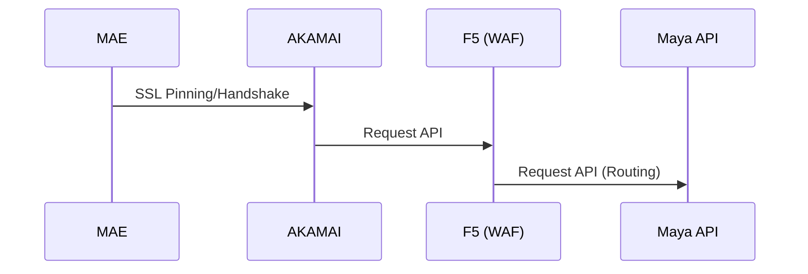
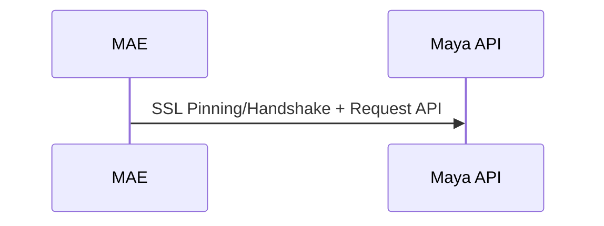

To View the Mermaid Markdown, Please Install "Markdown Preview Mermaid Support" then right & click "Open Preview"

# Overview SSL Pinning

## Production



## Staging



# How to get SSL SHA256 Pinning

1. Production: https://www.ssllabs.com/ssltest/analyze.html?d=maya.maybank2u.com.my
2. Staging: https://www.ssllabs.com/ssltest/analyze.html?d=staging.maya.maybank2u.com.my

# To Enable or Disable SSL Pinning

Configuration change in the .env file.

```
SSLPINNING_ENABLE=false
```
